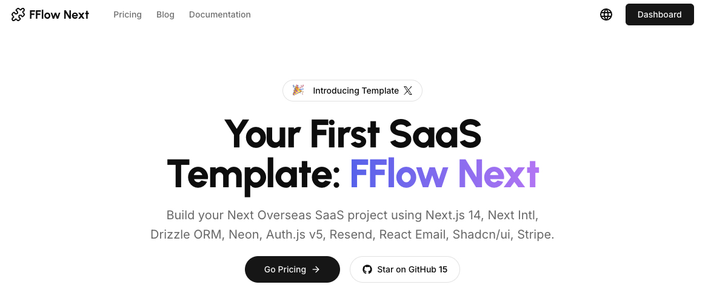

<a href="https://www.fflowlink.com">
  
</a>

<div align="center">
  <h1>FFlow Next</h1>
  <p><strong>Accelerate Your SaaS Journey</strong></p>
</div>

<p align="center">
  <a href="https://twitter.com/hunterzhang86">
    
  </a>
  <a href="https://github.com/hunterzhang86/fflow-next/blob/main/LICENSE.md">
    
  </a>
  <a href="https://github.com/hunterzhang86/fflow-next/stargazers">
    
  </a>
</p>

<p align="center">
  <a href="./README.md"></a>
  <a href="./README_CN.md"></a>
</p>

<p align="center">
  <a href="#-features"><strong>Features</strong></a> ·
  <a href="#-quick-start"><strong>Quick Start</strong></a> ·
  <a href="#-tech-stack"><strong>Tech Stack</strong></a> ·
  <a href="#-roadmap"><strong>Roadmap</strong></a> ·
  <a href="#-author"><strong>Author</strong></a> ·
  <a href="#-credits"><strong>Credits</strong></a>
</p>

<br/>

<div align="center">
  <a href="https://app.guidde.com/share/playbooks/dCsekcnKVF3ySsS7DRHDam">
    
    <p><strong>👆 Click to Watch Demo Video 👆</strong></p>
  </a>
</div>

## ✨ Features

FFlow Next is a full-featured SaaS project template designed for global business, integrating modern frontend technology stack to help developers quickly build and deploy professional-grade SaaS applications.

### 💻 Complete Project Architecture

- **Modern Frontend Framework** - App router based on Next.js 14
- **User Authentication** - Integrated with Auth.js v5, supporting multiple authentication methods
- **Multi-language Support** - Out-of-the-box internationalization for English, Chinese, and more
- **Database Integration** - Using Drizzle ORM with Neon serverless PostgreSQL
- **Payment System** - Built-in Stripe payment and subscription management
- **Email Functionality** - Send modern emails via Resend and React Email

### 💳 Subscription and Billing

- Diverse pricing plans and tiers
- Secure payment processing
- Subscription lifecycle management
- User quotas and limitations

### 🌐 Global-Ready

- UI/UX design adapted for international markets
- Easily localizable content structure
- Responsive design for all device sizes

### 🔒 Security and Performance

- Type-safe codebase
- Edge-optimized performance
- Secure user data handling

## 🚀 Quick Start

### Create New Project

```bash
# Using create-next-app
npx create-next-app my-saas-project --example "https://github.com/hunterzhang86/fflow-next"

# Or clone repository
git clone https://github.com/hunterzhang86/fflow-next.git my-saas-project
```

### Deploy to Vercel

One-click deployment to Vercel:

[](https://vercel.com/new/clone?repository-url=https%3A%2F%2Fgithub.com%2Fhunterzhang86%2Ffflow-next)

### Local Development

```bash
# 1. Install dependencies
pnpm install

# 2. Configure environment variables
cp .env.example .env.local
# Edit .env.local file with necessary environment variables

# 3. Start the development server
pnpm run dev
```

## 📚 Tech Stack

### 📦 Core Frameworks

- [Next.js 14](https://nextjs.org/) – React framework for best developer experience and optimized performance
- [Auth.js v5](https://authjs.dev/) – Modern authentication solution
- [Drizzle ORM](https://orm.drizzle.team/) – TypeScript-first ORM with type safety
- [Next-Intl](https://next-intl-docs.vercel.app/) – Complete internationalization solution
- [React Email](https://react.email/) – Modern email development framework

### 🎨 UI Components and Styling

- [Tailwind CSS](https://tailwindcss.com/) – Utility-first CSS framework
- [Shadcn/ui](https://ui.shadcn.com/) – Reusable components based on Radix UI
- [Framer Motion](https://framer.com/motion) – Powerful animation library
- [Lucide Icons](https://lucide.dev/) – Beautiful open-source icon set

### 🔌 Service Integrations

- [Vercel](https://vercel.com/) – Seamless deployment and preview
- [Neon](https://neon.tech/) – Serverless PostgreSQL database
- [Resend](https://resend.com/) – Modern email sending service
- [Stripe](https://stripe.com/) – Payment processing and subscription management

### 🛠️ Development Tools

- [TypeScript](https://www.typescriptlang.org/) – Static type checking
- [ESLint](https://eslint.org/) & [Prettier](https://prettier.io/) – Code quality and formatting
- [Vercel Analytics](https://vercel.com/analytics) – Privacy-friendly analytics

## 🛣️ Roadmap

We're working to make FFlow Next even better. Here's what we're currently working on:

- [ ] Upgrade ESLint to v9
- [ ] Add email notifications for successful subscriptions
- [ ] Integrate Google Analytics
- [ ] Support for additional languages
- [ ] More payment gateway integrations
- [ ] Admin dashboard enhancements

## 👨‍💻 Author

Created by [Hunter Zhang](https://twitter.com/hunterzhang86) in 2024, released under the [MIT license](https://github.com/hunterzhang86/fflow-next/blob/main/LICENSE.md).

## 🙏 Credits

This project was inspired by these excellent open-source projects:

- [next-saas-stripe-starter](https://github.com/mickasmt/next-saas-stripe-starter)
- [Taxonomy](https://github.com/shadcn-ui/taxonomy) by Shadcn
- [Precedent](https://github.com/steven-tey/precedent) by Steven Tey
- [Next 13 AI SaaS](https://github.com/AntonioErdeljac/next13-ai-saas) by Antonio Erdeljac

## 🌟 Showcase

Projects built with FFlow Next:

- [Cross Hub](https://www.crosshubs.com) - Ultimate Cross-Border Business Toolkit
- [AI Nexus](https://www.myaiexp.com) - Empowering build AI apps faster

## 🤝 Contributing

Contributions are welcome! Please check out our [contributing guidelines](CONTRIBUTING.md) to get started.

## 📄 License

[MIT License](LICENSE.md) © 2024 [Hunter Zhang](https://twitter.com/hunterzhang86)
