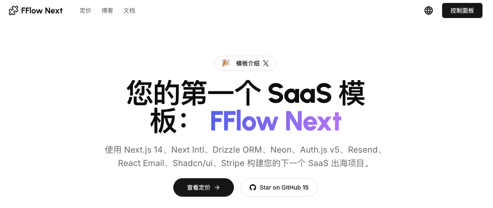

<a href="https://www.fflowlink.com">
  
</a>

<div align="center">
  <h1>FFlow Next</h1>
  <p><strong>加速您的出海 SaaS 之旅</strong></p>
</div>

<p align="center">
  <a href="https://twitter.com/hunterzhang86">
    
  </a>
  <a href="https://github.com/hunterzhang86/fflow-next/blob/main/LICENSE.md">
    
  </a>
  <a href="https://github.com/hunterzhang86/fflow-next/stargazers">
    
  </a>
</p>

<p align="center">
  <a href="./README.md"></a>
  <a href="./README_CN.md"></a>
</p>

<p align="center">
  <a href="#✨-特性"><strong>特性</strong></a> ·
  <a href="#🚀-快速开始"><strong>快速开始</strong></a> ·
  <a href="#📚-技术栈"><strong>技术栈</strong></a> ·
  <a href="#🛣️-路线图"><strong>路线图</strong></a> ·
  <a href="#👨‍💻-作者"><strong>作者</strong></a> ·
  <a href="#🙏-致谢"><strong>致谢</strong></a>
</p>

<br/>

<div align="center">
  <a href="https://app.guidde.com/share/playbooks/dCsekcnKVF3ySsS7DRHDam">
    
    <p><strong>👆 点击观看演示视频 👆</strong></p>
  </a>
</div>

## ✨ 特性

FFlow Next 是一个功能齐全的 SaaS 项目模板，专为出海业务设计，集成了现代前端技术栈，帮助开发者快速构建和部署专业级的 SaaS 应用。

### 💻 完整项目架构

- **现代化前端框架** - 基于 Next.js 14 的应用路由
- **用户认证系统** - 集成 Auth.js v5，支持多种认证方式
- **多语言支持** - 开箱即用的国际化方案，支持英文、中文等多语言
- **数据库集成** - 使用 Drizzle ORM 与 Neon 无服务器 PostgreSQL
- **支付系统** - 内置 Stripe 支付与订阅管理流程
- **邮件功能** - 通过 Resend 和 React Email 发送现代化电子邮件

### 💳 订阅和计费

- 多样化的定价计划和层级
- 安全的支付处理
- 订阅生命周期管理
- 用户配额和限制

### 🌐 全球化准备

- 适配国际市场的 UI/UX 设计
- 轻松本地化的内容结构
- 响应式设计，支持各种设备尺寸

### 🔒 安全与性能

- 类型安全的代码库
- 边缘优化的性能
- 安全的用户数据处理

## 🚀 快速开始

### 创建新项目

```bash
# 使用 create-next-app 创建项目
npx create-next-app my-saas-project --example "https://github.com/hunterzhang86/fflow-next"

# 或者克隆仓库
git clone https://github.com/hunterzhang86/fflow-next.git my-saas-project
```

### 部署到 Vercel

一键部署到 Vercel 平台：

[](https://vercel.com/new/clone?repository-url=https%3A%2F%2Fgithub.com%2Fhunterzhang86%2Ffflow-next)

### 本地开发

```bash
# 1. 安装依赖
pnpm install

# 2. 配置环境变量
cp .env.example .env.local
# 编辑 .env.local 文件填入必要的环境变量

# 3. 启动开发服务器
pnpm run dev
```

## 📚 技术栈

### 📦 核心框架

- [Next.js 14](https://nextjs.org/) – React 框架，提供最佳开发体验和性能优化
- [Auth.js v5](https://authjs.dev/) – 现代化的身份验证解决方案
- [Drizzle ORM](https://orm.drizzle.team/) – TypeScript 优先的 ORM，提供类型安全
- [Next-Intl](https://next-intl-docs.vercel.app/) – 完整的国际化解决方案
- [React Email](https://react.email/) – 现代化的电子邮件开发框架

### 🎨 UI 组件和样式

- [Tailwind CSS](https://tailwindcss.com/) – 实用优先的 CSS 框架
- [Shadcn/ui](https://ui.shadcn.com/) – 基于 Radix UI 的可复用组件
- [Framer Motion](https://framer.com/motion) – 强大的动画库
- [Lucide Icons](https://lucide.dev/) – 精美的开源图标集

### 🔌 服务集成

- [Vercel](https://vercel.com/) – 无缝部署和预览
- [Neon](https://neon.tech/) – 无服务器 PostgreSQL 数据库
- [Resend](https://resend.com/) – 现代化邮件发送服务
- [Stripe](https://stripe.com/) – 支付处理和订阅管理

### 🛠️ 开发工具

- [TypeScript](https://www.typescriptlang.org/) – 静态类型检查
- [ESLint](https://eslint.org/) & [Prettier](https://prettier.io/) – 代码质量和格式化
- [Vercel Analytics](https://vercel.com/analytics) – 隐私友好的分析

## 🛣️ 路线图

我们正在努力使 FFlow Next 变得更好，以下是我们正在进行的工作：

- [ ] 升级 ESLint 到 v9
- [ ] 添加订阅成功后的邮件通知
- [ ] 集成 Google Analytics
- [ ] 更多语言支持
- [ ] 更多支付网关集成
- [ ] 管理员仪表盘增强

## 👨‍💻 作者

由 [Hunter Zhang](https://twitter.com/hunterzhang86) 创建于 2024 年，基于 [MIT 许可证](https://github.com/hunterzhang86/fflow-next/blob/main/LICENSE.md) 发布。

## 🙏 致谢

此项目受到以下优秀开源项目的启发：

- [next-saas-stripe-starter](https://github.com/mickasmt/next-saas-stripe-starter)
- [Taxonomy](https://github.com/shadcn-ui/taxonomy) by Shadcn
- [Precedent](https://github.com/steven-tey/precedent) by Steven Tey
- [Next 13 AI SaaS](https://github.com/AntonioErdeljac/next13-ai-saas) by Antonio Erdeljac

## 🌟 案例展示

使用 FFlow Next 构建的项目：

- [跨境星图](https://www.crosshubs.com) - 跨境业务全流程工具导航
- [AI 星图](https://www.myaiexp.com) - 助力快速构建 AI 应用


## 🤝 贡献

欢迎贡献！请查看我们的 [贡献指南](CONTRIBUTING.md) 了解如何参与。

## 📄 许可证

[MIT 许可证](LICENSE.md) © 2024 [Hunter Zhang](https://twitter.com/hunterzhang86)
